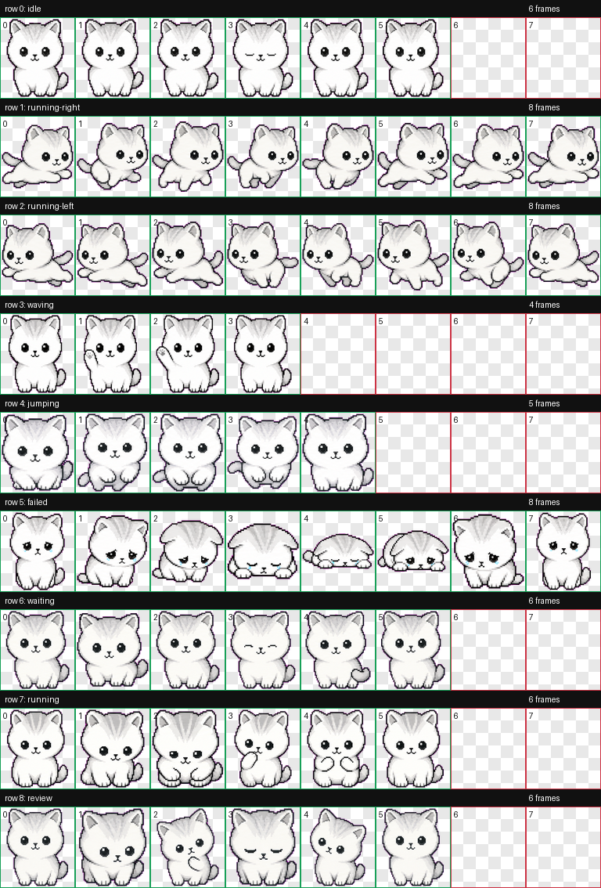

# 银霜：Codex 银渐层小猫宠物

银霜是一只为 Codex 制作的自定义桌面宠物。它是一只圆脸、白毛、浅银毛尖的银渐层小猫，整体是小尺寸像素风，适合放在 Codex 工作区里陪你写代码。

## 预览

| 待机 | 挥手 | 跳跃 | 跑动 | 失败 |
| --- | --- | --- | --- | --- |
|  |  |  |  |  |

## 动作总览



## 文件

- `silver-frost/pet.json`
- `silver-frost/spritesheet.webp`

## 使用方法

把 `silver-frost` 文件夹复制到你的 Codex 宠物目录：

```text
%USERPROFILE%\.codex\pets\silver-frost
```

然后重启 Codex，就可以在宠物列表里看到银霜。
